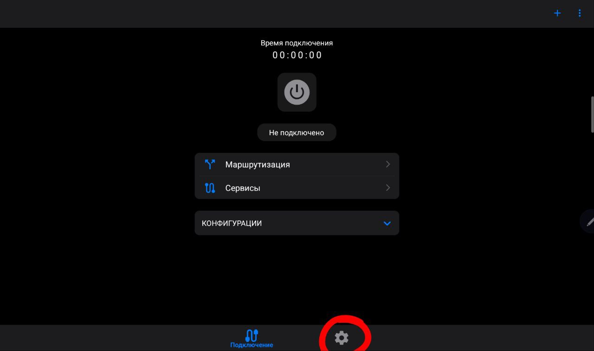
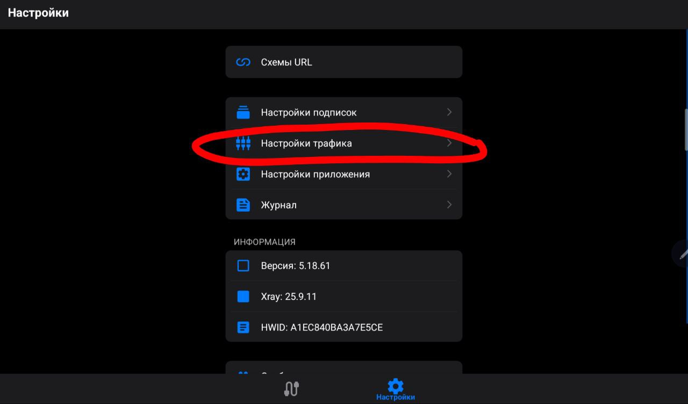
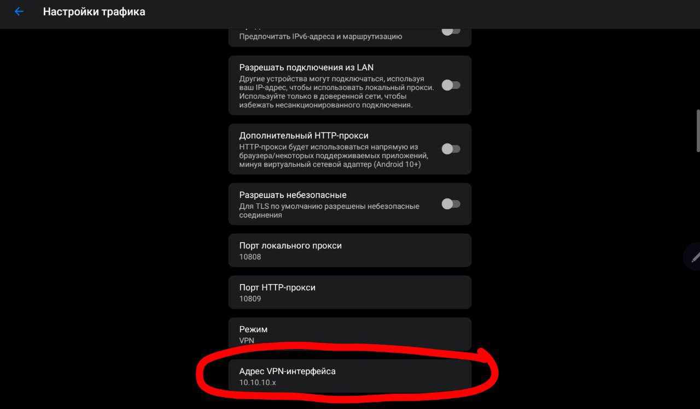
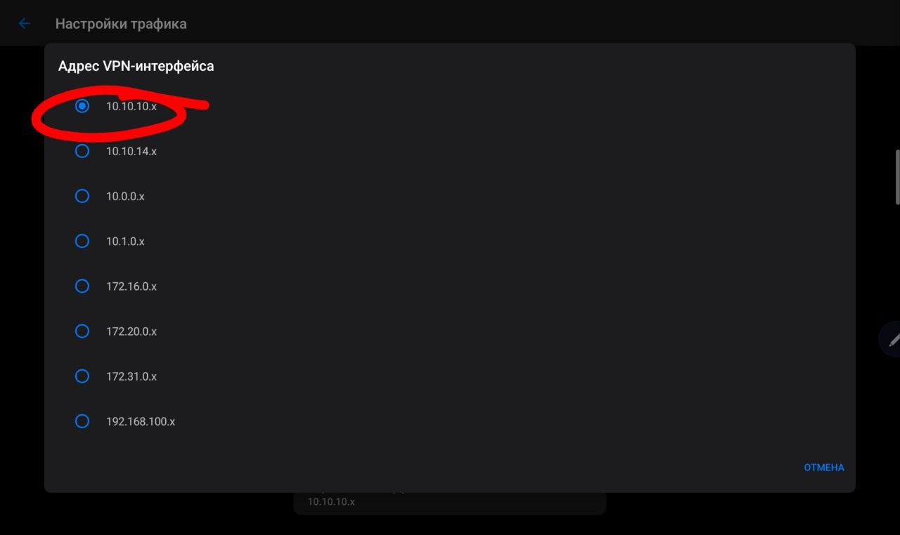
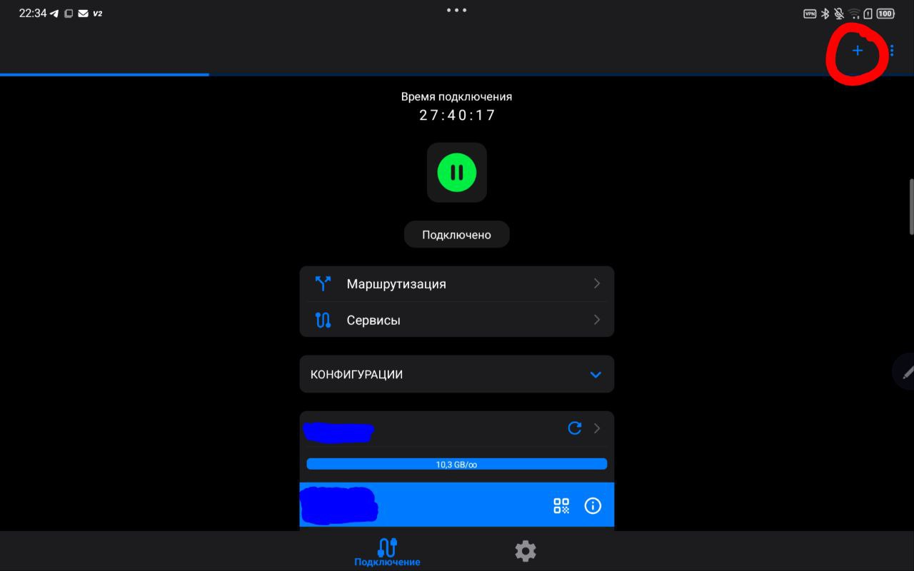
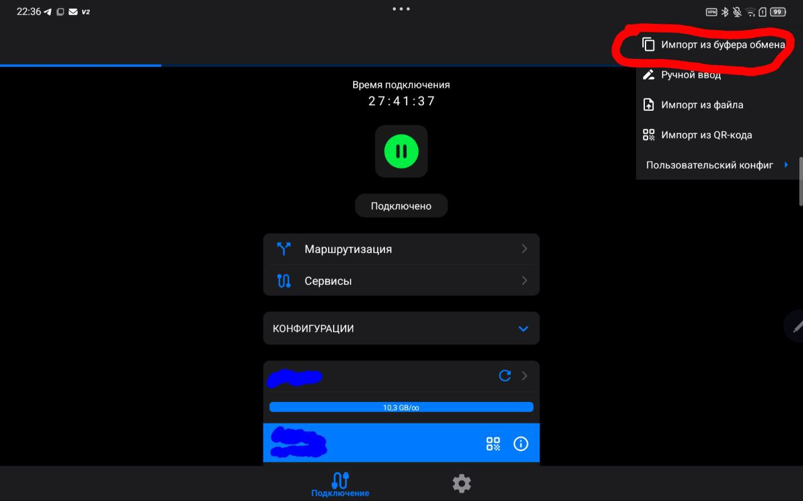
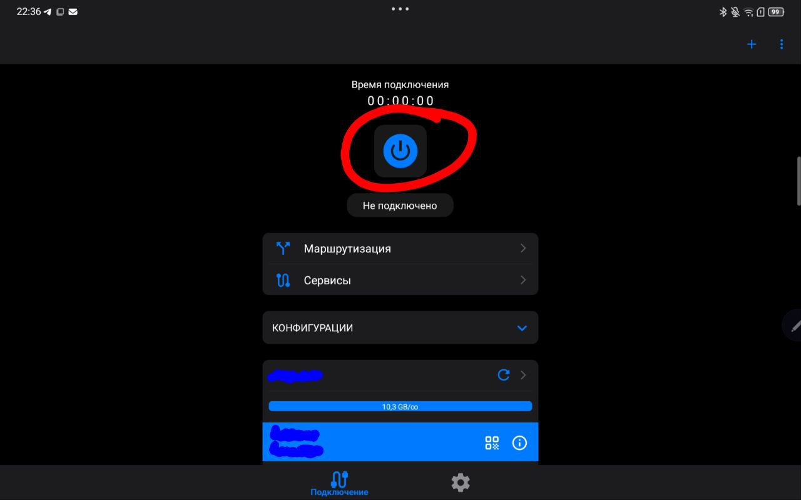

В этом разделе представлена пошаговая инструкция с визуальным сопровождением по настройке Terminator VPN на Windows
---

### 0. 

По ссылке (https://github.com/DigneZzZ/v2raytun/releases) скачайте v2raytun

---

---

### 1. 
Перейдите в настройки

---

### 2.
Зайдите в пункт "Настройки трафика"
  

---

### 3.
Зайдите в "Адрес VPN-интерфейса"

---

### 4.
Выберите пункт "10.10.10.х"

---

### 5.
Вернитесь на основной экран и нажмите на "плюс"

---

### 6.
Нажмите "Импорт из буфера обмена"

---

### 7.
Нажмите на центральную кнопку

---
